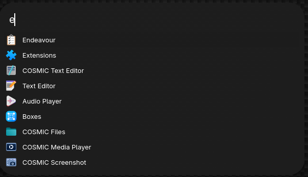

# Launch

A sleek, pill-shaped application launcher for Linux, built with Rust and GTK4. Designed with strict adherence to "Tree Architecture" for stability and maintainability.



## Features

- **Sleek Design**: Transparent, pill-shaped UI (`border-radius: 30px`).
- **Fast Search**: Fuzzy search through your installed applications (`.desktop` files).
- **Visual Feedback**: Displays application icons.
- **Keyboard Navigation**:
  - `Up` / `Down`: Navigate results.
  - `Enter`: Launch selected application (or Enter directory).
  - `Right Arrow`: Enter highlighted directory (File Browser).
  - `Left Arrow`: Go up one directory level (File Browser).
  - `Ctrl + 1-9`: Quick launch the Nth result.
  - `Escape`: Close the launcher.
- **Overview Grid**: Press `Down` to reveal a sectioned, horizontally scrollable grid of your apps, folders, shortcuts, and more.
- **Status Indicators**: Highlights running applications with a blue notification dot.

## Usage

### 🚀 Prefixes

Launch uses strict prefixes to route your queries to different providers:

| Prefix | Name | Description | Example |
| :--- | :--- | :--- | :--- |
| `?` | **AI** | Local LLM search & assistant (supports RAG/File Awareness). | `? where is my project?` |
| `x` | **Execute** | Run a shell command in a terminal wrapper. | `x top` (runs `gnome-terminal -- top`) |
| `f` | **Files** | Browse the filesystem. Use `Left`/`Right` keys to navigate. | `f /home/user/` |
| `ss` | **Shortcuts** | Run a saved shortcut. | `ss term` |
| `m` | **Macros** | Execute a sequence of commands (Macro). | `m dev-setup` |
| `c` | **Calc** | Solve math expressions (supports complex LaTeX: `\sin`, `\log`, `2\pi e`, `\frac{1}{2}`, infinite/NaN handling). | `c \sqrt{16} * 2` |
| `d` | **Dict** | Smart Dictionary. Offline lookup (Webster) + Online Fallback (Google). | `d rust` |
| `w` | **Window** | Switch to open windows. Shows [Workspace] and [Screen] indicators. | `w term` |
| `!` | **System** | Power operations (suspend, reboot, poweroff). | `! reboot` |
| `l` | **Launch** | Internal commands (Settings, About, Quit). | `l settings` |

### 🧠 AI Assistant (`?`)

Launch features a built-in AI assistant powered by **Ollama**. It is private, local, and aware of your files.

- **File Awareness (RAG)**: The assistant automatically indexes your home directory (up to 4 levels) to answer context-specific questions about your files and projects.
- **Local & Private**: No data leaves your machine. Everything runs via your local Ollama instance.
- **Streaming Progress**: Integrated download progress bar when switching models.

#### 🛠️ AI Setup

To use the AI features, you need to have [Ollama](https://ollama.com/) installed on your Linux system.

1. **Install Ollama**:
   ```bash
   curl -fsSL https://ollama.com/install.sh | sh
   ```

2. **Pull a Default Model**:
   Launch defaults to `llama3`. You can pull it manually or use the Settings UI:

   ```bash
   ollama pull llama3
   ```

3. **Automatic Start**: Launch will attempt to start the Ollama server (`ollama serve`) automatically if it's not running when you send a query.

4. **Configure Models**:
   - Type `l settings` and go to the **AI** tab.
   - Select your preferred model (e.g., `llama3`, `mistral`, or `tinyllama` for speed).
   - Launch will handle the download and setup for you!

### ⚙️ Configuration

Launch is fully configurable via an interactive UI.

1. Type `l settings` (or `l set`) and hit **Enter**.
2. Use the **Tabs** to switch between **Shortcuts**, **Macros**, and **AI**.
3. **Add**: Click "Add" to define a new item.
4. **Delete**: Select an item and click "Delete" to remove it.

Changes are persisted to `~/.config/launch/settings.json`.

#### Example `settings.json`

```json
{
  "shortcuts": {
    "term": "gnome-terminal",
    "web": "firefox"
  },
  "macros": [
    {
      "name": "morning",
      "actions": [
        "notify-send 'Good Morning'",
        "firefox https://news.ycombinator.com"
      ]
    }
  ]
}
```

### 👻 Daemon Mode

Launch runs as a background daemon.
- Run `launch toggle` to show/hide the window.
- Bind `launch toggle` to a global shortcut in your Desktop Environment (e.g., `Super+Space`).
- The window automatically hides when it loses focus or when an app is launched.

### 📱 Overview Grid

When the search bar is empty, press `Down` to open the Overview Grid. This view gives you quick access to all your content categorized into horizontal sections:

- **Applications**: All installed apps. Scroll horizontally to see more.
- **Folders**: Your home directory folders.
- **Shortcuts / Macros**: Quick access to your defined actions.
- **AI**: Ask the assistant.
- **Settings / System**: Quick toggles and configuration.

**Navigation**:
- `Up` / `Down`: Jump between sections.
- `Left` / `Right`: Scroll through items within a section.

## Tech Stack

- **Language**: [Rust](https://www.rust-lang.org/) (2024 Edition)
- **GUI**: [GTK4](https://gtk.org/)
- **Architecture**: Tree Architecture (Domain -> Application -> Interface -> Infrastructure)

## Installation

### Prerequisites

- Rust & Cargo
- GTK4 development libraries (e.g., `libgtk-4-dev` on Debian/Ubuntu, `gtk4-devel` on Fedora)

### Building from Source

```bash
git clone https://github.com/leechristophermurray/launch.git
cd launch
cargo run --release
```

### Building Packages (.deb / .rpm)

The project includes a helper script to generate Linux packages.

```bash
./build_packages.sh
```

Artifacts will be output to:
- `target/debian/*.deb`
- `target/generate-rpm/*.rpm`

## Architecture

This project follows the **Tree Architecture** pattern:

- 🔴 **Domain**: Pure business entities (`App`, `Shortcut`).
- 🟡 **Application**: Use cases (`SearchApps`, `ExecuteCommand`).
- 🟢 **Interface**: abstract Ports (`IAppRepository`).
- 🔵 **Infrastructure**: Concrete Adapters (`LinuxAppRepoAdapter`, `AppWindow`).

## License

MIT License. See [LICENSE](LICENSE) for details.
