# **Tree Architecture: A Formalized Graph-Theoretic Framework for Hexagonal Software Design**

Version: 1.5

Date: 2026-01-12

Author: [Christopher Murray](https://gitlab.rcs.ucalgary.ca/christopher.murra2)

## **1. Introduction to Tree Architecture**

The contemporary software engineering landscape is characterized by an incessant struggle against entropy. As systems expand in functionality, their internal complexity tends to grow superlinearly, leading to architectures that are difficult to visualize, expensive to maintain, and risky to modify. While established patterns such as Hexagonal Architecture (Ports and Adapters), Onion Architecture, and Clean Architecture provide the necessary semantic boundaries to decouple business logic from infrastructure, they often lack a rigorous, mathematically verifiable visual representation. They act as guiding philosophies rather than enforceable laws.
This report introduces "Tree Architecture," a novel architectural meta-model that projects the concentric principles of Domain-Driven Design (DDD) and Clean Architecture onto a hierarchical, weighted tree structure. By visualizing the system as a "Flowchart"—where the core domain resides at the root and implementation details radiate outward as leaves—we bridge the gap between abstract architectural principles and concrete, graph-theoretic analysis. This framework utilizes the Mermaid diagramming syntax to render these structures, applying specific color-coded layers to visually enforce Separation of Concerns (SoC). Furthermore, it establishes a mathematical foundation for calculating the "weight" of the architecture, a composite metric derived from node complexity and edge coupling, to formally predict the Total Cost of Ownership (TCO), maintenance burden, and performance characteristics.
The central thesis of Tree Architecture is that software structural integrity can be formally verified by treating the codebase as a directed graph with tree-like topological constraints. By optimizing for "lightweight edges"—dependencies that are semantically thin and strictly directional—we can mathematically prove adherence to the Dependency Inversion Principle (DIP) and the Stable Dependency Principle (SDP), thereby ensuring a system that remains performant and economically viable over its lifecycle.

\newpage

## **2. Theoretical Foundations and Architectural Convergence**

### **2.1 The Geometric Evolution: From Layers to Hexagons to Trees**

Traditional Layered Architecture (N-Tier) organized software into a vertical stack: Presentation, Business, and Data Access. While simple, this topology often led to the "database-centric" anti-pattern, where business logic became tightly coupled to the persistence layer, making testing difficult and refactoring costly. Alistair Cockburn’s Hexagonal Architecture challenged this by flattening the stack into an "inside" and "outside." The "inside" (Application Core) defines the ports (interfaces), and the "outside" (User Interface, Database, External APIs) provides the adapters.
Tree Architecture is a topological transformation of the Hexagonal model. If one takes the concentric circles of Clean Architecture and "pulls" the center (Domain) upwards, the concentric rings cascade down to form a tree structure (or more accurately, a rooted Directed Acyclic Graph). In this visualization:

* The **Root Node** represents the Bounded Context or the Core Domain.
* The **Inner Branches** represent the Use Cases and Domain Entities.
* The **Outer Branches** represent the Interface Adapters (Controllers, Presenters).
* The **Leaves** represent the Infrastructure (Databases, UI Frameworks, External Services).

This projection onto a tree structure is not merely aesthetic; it unlocks the powerful analytical tools of graph theory. Trees have well-defined properties—depth, height, branching factor, and path length—that can be directly correlated with software quality metrics such as maintainability, testability, and cognitive load.

### **2.2 Domain-Driven Design (DDD) as the Semantic Engine**

Tree Architecture relies on Domain-Driven Design to define the identity of the nodes within the graph. Without the semantic rigor of DDD, the tree would be an arbitrary collection of classes. By classifying nodes into specific DDD tactical patterns, we can apply strict rules to their relationships.

* **Aggregate Roots:** These serve as the primary structural anchors within the Domain layer. They enforce consistency boundaries and control access to internal entities. In the tree, they appear as major sub-nodes of the Domain root.
* **Entities and Value Objects:** These are the leaf nodes of the purely domain branch. They encapsulate data and behavior but must have zero dependencies on outer layers (Infrastructure).
* **Domain Services:** These nodes encapsulate logic that spans multiple entities but does not naturally belong to any single one.
* **Repositories (Ports):** These acts as the "connectors" or explicit boundaries. In the graph, they are the transition points where the color shifts from Domain (Business Logic) to Infrastructure (IO).

By mapping these concepts to the tree, we enable "Semantic Verification." A dependency edge connecting a **Value Object** directly to an **Infrastructure Adapter** is not just a code smell; it is a topological violation of the tree structure that can be mathematically detected and flagged.

## **3. Mathematical Formalization of Tree Architecture**

To move from qualitative design to quantitative analysis, we must define Tree Architecture mathematically. This formalization allows us to calculate costs and prove adherence to design principles.

### **3.1 Graph Theoretic Definition**

Let the software architecture be represented as a directed graph $G = (V, E)$, where V is the set of vertices (software components) and E is the set of directed edges (dependencies).

$V = {v_1, v_2, \dots, v_n}$

$E = \{(u, v) \mid u, v \in V, \text{ u depends on v}\}$

In a valid Tree Architecture, the graph G must ideally approximate a **Rooted Tree** or a **Directed Acyclic Graph (DAG)** with a dominant hierarchy. The "Root" of the graph (R) represents the core domain.
The topology is constrained by the **Layer Function**, $L: V \rightarrow \mathbb{N}$, which maps each node to a specific architectural layer index:

* $L(v) = 0$: Domain (Business Logic)
* $L(v) = 1$: Application (Use Cases)
* $L(v) = 2$: Interface Adapters (Controllers, Presenters)
* $L(v) = 3$: Infrastructure (IO, DB, Web)

### **3.2 Node Identity Formulas and Complexity Weight $(W_N)$**

Each node v possesses an intrinsic complexity, denoted as $W_N(v)$. This weight is non-uniform and depends on the node's **Identity** $(I_v)$. The identity determines the formula used to calculate its weight, reflecting the different cost structures of different architectural elements.
We propose a Generalized Complexity Formula for a node:
Where:

* $\text{CC}(v)$: Cyclomatic Complexity of the node (number of linearly independent paths).
* $\text{WMC}(v)$: Weighted Methods per Class.
* $\text{LOC}(v)$: Lines of Code.
* $\alpha$, $\beta$, $\gamma$: Normalization constants derived from historical project data.
* $\lambda_{type}$: The **Identity Factor**, a multiplier based on the node's architectural role.

**Identity Factors ($\lambda_{type}$):**

* **Identity: Value Object / Entity (Business Logic)**
  * $\lambda \approx 1.5$. High value. Complexity here is essential domain complexity. Changes here are expensive due to propagation risk, but necessary.
* **Identity: Use Case (Component)**
  * $\lambda \approx 1.0$. Orchestration logic. Moderate cost.
* **Identity: Controller / Presenter**
  * $\lambda \approx 0.8$. These should be "Humble Objects" with minimal logic. High complexity here indicates a "Fat Controller" anti-pattern.
* **Identity: Infrastructure Adapter**
  * $\lambda \approx 0.5$. Boilerplate code. Complexity here is often accidental.

This formula allows us to spot anomalies. If an Infrastructure node has a calculated $W_N$ higher than a Domain node, the architecture is likely leaking business rules into the wrong layer.

### **3.3 Edge Weight and Coupling Physics ($W_E$)**

The concept of **"Lightweight Edges"** is central to this architecture. An edge $e = (u, v)$ has a weight $W_E(e)$ that represents the cost of maintaining that dependency.

$$W_E(u, v) = \text{CouplingType}(u, v) \times \text{Frequency}(u, v) \times \text{Distance}(u, v)$$

1. **CouplingType:**
   * **Implementation Inheritance:** Weight = 5 (Heaviest). Changes in parent force recompilation/testing of child. "Fragile Base Class" problem.
   * **Direct Instantiation (`new Class()`):** Weight = 3. Tight coupling. Hard to mock.
   * **Composition (Interface Injection):** Weight = 1 (Lightest). The dependent only knows the contract. This is the goal of "Lightweight Edges."
2. **Frequency:** The number of calls or volume of data passed along the edge. High frequency suggests high runtime coupling.
3. **Distance:** The number of layers crossed.
   * Layer $N \rightarrow N$ (Same layer): Distance = 1.
   * Layer $N \rightarrow N-1$ (Standard dependency): Distance = 1.
   * Layer $N \rightarrow N+1$ (Inverted dependency via interface): Distance = 1.
   * Layer $N \rightarrow N-2$ (Skipping layers, e.g., Controller $\rightarrow$ Entity): Distance = 5 (Penalty for "Layer Skipping").

**The Lightweight Edge Principle:** To maximize performance and testability, the architecture must minimize $\sum W_E$. This is achieved by:

* Replacing Inheritance with Composition (5 $\rightarrow$ 1).
* Replacing Direct Instantiation with Dependency Injection (3 $\rightarrow$ 1).
* Strictly adhering to Layer boundaries to avoid Distance penalties.

### **3.4 Formal Verification of the Dependency Inversion Principle (DIP)**

The Tree Architecture allows for a mathematical proof of adherence to the Dependency Inversion Principle. The DIP states that high-level modules should not depend on low-level modules; both should depend on abstractions.

**Verification Rule:** For every edge $(u, v) \in E$, where $u$ depends on $v$:

1. If $L(u) < L(v)$ (Inner layer depending on Outer layer), then the edge must target an **Abstraction** (Interface/Port) defined in layer $L(u)$.
2. The implementation of that abstraction resides in $L(v)$.

**Proof via Instability Metrics (I):** Using Robert C. Martin's Instability metric $I = \frac{Fan_{out}}{Fan_{in} + Fan_{out}}$ : A stable architecture requires that for any dependency $u \rightarrow v$, the instability of the dependee must be lower than the dependent:

$$I(v) \leq I(u)$$

In Tree Architecture:

* **Domain (Root):** $Fan_{out} \approx 0$ (depends on nothing). Thus $I \approx 0$ (Maximally Stable).
* **Infrastructure (Leaves):** $Fan_{out} \> 0$ (depends on Domain interfaces). $Fan_{in} = 0$ (nothing depends on infra). Thus $I = 1$ (Maximally Unstable).

The flow of dependency is Infrastructure $\rightarrow$ Domain, which is 1 $\rightarrow$ 0. Since 0 $\leq$ 1, the inequality $I(Domain) \leq I(Infra)$ holds. If the graph shows an edge where a Domain Entity depends on a Controller (0 $\rightarrow$ 2), the instability comparison would fail ($I(Controller) \approx 1 \> I(Entity) \approx 0$), flagging a violation.

## **4. Cost Analysis: The Propagation Cost Model**

The ability to analyze the cost of development, maintenance, and change is a critical requirement. We utilize the **Propagation Cost** metric derived from the Design Structure Matrix (DSM) literature (MacCormack et al.).

### **4.1 Cost of Making Changes ($\text{Cost}_{\Delta}$)**

The cost to modify a specific node $v_{target}$ is the sum of the effort to change the node itself plus the effort to verify and potentially modify all nodes that depend on it (transitive closure of dependencies).

$$\text{Cost}_{\Delta}(v_{target}) = W_N(v_{target}) + \sum_{u \in \text{Ancestors}(v_{target})} \left( \text{Probability}(u, v_{target}) \cdot W_N(u) \cdot W_E(u, \dots, v_{target}) \right)$$

Where:
* $\text{Ancestors}(v_{target}$): All nodes that directly or indirectly depend on $v_{target}$.
* $\text{Probability}(u, v_{target}$): The likelihood that a change in $v_{target}$ propagates to $u$. In a "Lightweight Edge" architecture (Interface-based), this probability is low. In a "Heavy Edge" architecture (Inheritance), it approaches 1.0.

### **4.2 Economic Implications of the Tree Structure**

1. **Development Cost:** High cohesion (clustering related nodes in sub-trees) reduces context switching. Development cost is proportional to the size of the subtree required to implement a feature. $Cost_{dev} \propto \sum_{v \in FeatureBranch} W_N(v)$.
2. **Maintenance Cost:** Maintenance is dominated by understanding complexity. A deep, narrow tree has high cognitive load for traversal. A wide, shallow tree (flattened hierarchy) is easier to maintain. We utilize the Maintainability Index (MI) adapted for graphs:

$$MI_{graph} = 171 - 5.2 \ln(Avg(W_N)) - 0.23(Avg(W_E)) - 16.2 \ln(\text{TotalNodes})$$

Keeping $W_E$ low directly boosts the Maintenance Index.

3. **Testing Performance:** Test execution time is a function of the subgraph required to instantiate the System Under Test (SUT).

$$T_{test}(v) = T_{exec}(v) + \sum_{d \in \text{Dependencies}(v)} T_{setup}(d)$$

By using Lightweight Edges (Interfaces), dependencies can be mocked. The cost of mocking an interface is $\approx$ 0. The cost of instantiating a concrete heavy dependency (e.g., Database) is high. Therefore, Tree Architecture optimizes testing performance by enabling the "pruning" of heavy subtrees during test execution.

## **5. Visual Schema: The Mermaid Flowchart Implementation**

To operationalize Tree Architecture, we use **Mermaid flowcharts**. This tool allows for version-controllable, text-based architectural diagrams that can be rendered dynamically. We define a strict schema using **CSS Classes** to represent the architectural layers requested: Business Logic, Component, Test, IO, and Controllers.

### **5.1 The Color-Coded Layer Schema**

We assign a semantic color palette to the layers. This visual coding allows for "at-a-glance" verification: the tree should show a gradient from the core colors at the root to the infrastructure colors at the leaves.

| Layer Category | Mermaid Class | Fill Color | Stroke Color | Semantics |
| :---- | :---- | :---- | :---- | :---- |
| **Business Logic** | `:::business` | `#C8E6C9` (Green) | `#2E7D32` | The "Life" of the system. Pure, dependency-free. |
| **Component** | `:::component` | `#BBDEFB` (Blue) | `#1565C0` | Application Services, Use Cases. Orchestration. |
| **Controllers** | `:::controller` | `#FFF9C4` (Yellow) | `#FBC02D` | Interface Adapters. Entry points. |
| **IO / Infra** | `:::io`| `#FFCDD2` (Red) | `#C62828` | Dangerous, heavy dependencies. The "Dirty" layer. |
| **Test** | `:::test` | `#E1BEE7` (Purple) | `#7B1FA2` | Verification layer. Mirrors the structure. |

### **5.2 Mermaid Syntax Definition**

The schema uses the `flowchart` or `graph` diagram type. We explicitly define the classes and apply them to nodes to ensure consistent visualization.

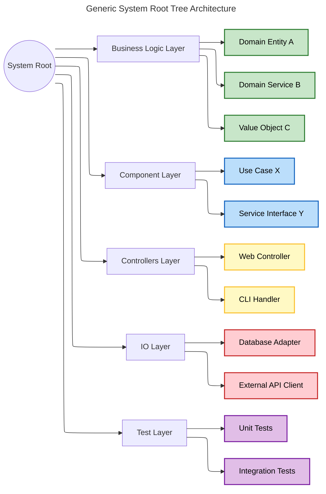

### **5.3 Case Study: Designing a Payment Gateway**

Let us apply this schema to a practical **Payment Gateway** solution to demonstrate the analysis of weights and costs.
**Scenario:** A system to process payments, requiring a Core Domain (logic), an API (Controller), and a Stripe connection (IO).

**Mermaid Diagram Implementation:**

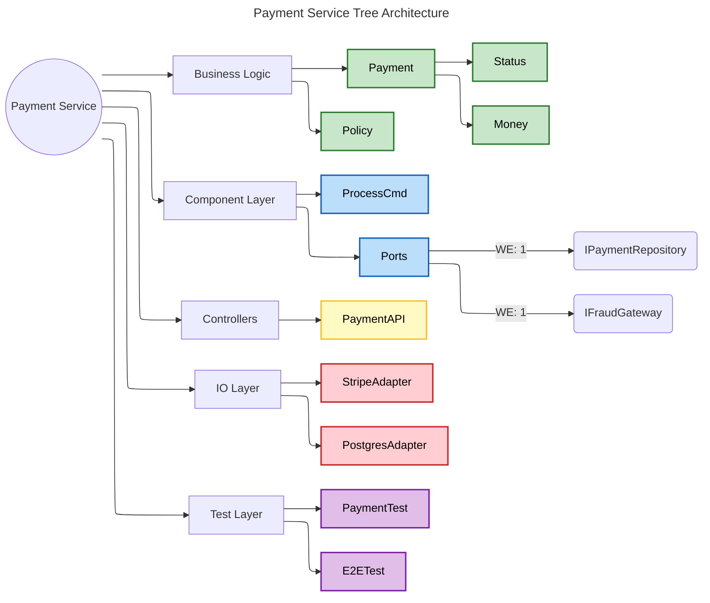

### **5.4 Analyzing the Case Study via Formulas**

**1. Verifying "Lightweight Edges" ($W_E$):** In the diagram, the `ProcessPayment Cmd` (Component) needs to save data.

* **Wrong Way:** It instantiates `PostgresAdapter` directly.
  * $W_E = \text{Tight Coupling} (3) \times \text{Distance} (2) = 6$.
* **Tree Architecture Way:** It depends on `IPaymentRepository` (Port).
  * $W_E = \text{Interface} (1) \times \text{Distance} (0) = 1$.
* **Result:** The edge is lightweight. The cost of verifying the `ProcessPayment Cmd` does not include the complexity of `PostgresAdapter`.

**2. Development Cost Prediction:** To implement the `Refund Policy`:

* Nodes involved: `Refund Policy`, `Payment Aggregate`, `Status VO`.
* $\text{Cost} \approx W_N(\text{Policy}) + W_N(\text{Payment}) + W_N(\text{Status}) = 8 + 15 + 2 = 25 \text{ CLU} (Cognitive Load Units)$.
* Since these are all in the **Green (Business)** layer, the friction is minimal.

**3. Change Propagation Analysis:** If we change the `Stripe Adapter` (IO Layer, Red):

* Dependents: None (in source code logic, as the Controller depends on the Port, and the Adapter implements the Port).
* Propagation Cost = $W_N(\text{Stripe}) = 12$.
* **Insight:** Changing the heaviest infrastructure part is cheap because it is a "Leaf" in the tree.

If we change the `Money VO` (Business Logic, Green):

* Dependents: `Payment Aggregate`, `ProcessPayment Cmd`, `Payment API`, `Stripe Adapter`, `Postgres Adapter`.
* Propagation Cost = Huge.
* **Strategic Insight:** This justifies extreme rigor (TDD, formal verification) for the Green layer, as errors there have the highest "Blast Radius".

## **6. Performance and Testing Implications**

We claim that keeping edges lightweight makes the solution "more performant." This claim can be substantiated through the lens of **Dependency Resolution** and **Test Execution**.

### **6.1 Performance via Compilation Firewalls**

In statically typed languages (Java, C++, C#), a "Lightweight Edge" (interface dependency) acts as a compilation firewall. When the body of a concrete implementation (e.g., `PostgresAdapter`) changes, modules depending on the `IPaymentRepository` interface do not need recompilation. This reduces the **Feedback Loop Time** for developers, directly lowering the "Cost of Development".

### **6.2 Test Driven Design (TDD) Optimization**

Tree Architecture is optimized for TDD. Because the "Business Logic" branch is decoupled from "IO" via lightweight edges (Ports):

1. **Unit Tests** for the Domain can run in milliseconds because they never load the heavy IO subtrees.
2. **Mocking** is mathematically guaranteed to be possible because all cross-layer edges are interfaces.
3. **Test Coverage** can be visualized on the Flowchart. We can color nodes based on coverage (e.g., Green = 100%, Red = 0%), providing a visual heatmap of quality risk.

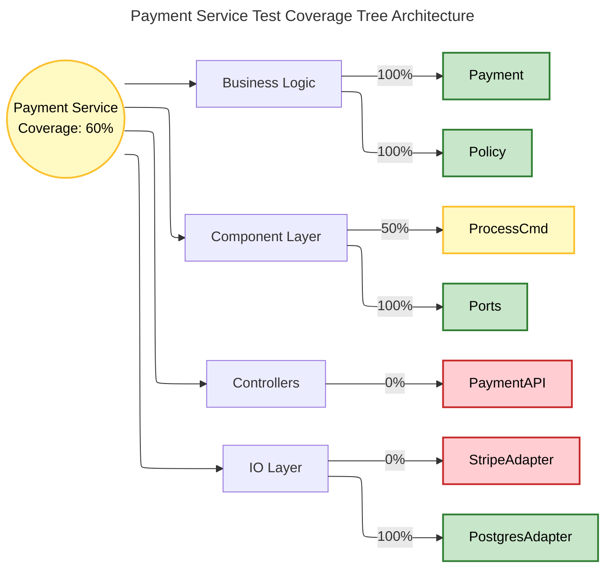


### **6.3 Test Execution via Subtree Pruning**

By using Lightweight Edges (Interfaces), dependencies can be mocked. The cost of mocking an interface is $\approx$ 0. The cost of instantiating a concrete heavy dependency (e.g., Database) is high. Therefore, Tree Architecture optimizes testing performance by enabling the "pruning" of heavy subtrees during test execution.

## **7. Strategic Recommendations for Implementation**

To successfully implement Tree Architecture in a professional setting, the following steps are recommended:

1. **Automated Visualization Pipeline:** Do not maintain the Flowchart manually. We will implement a CI/CD step that parses the codebase (using tools like `tree-sitter` for Rust, Roslyn for C# or JavaParser) and generates the Mermaid `.mmd` file automatically. This ensures the map represents the *actual* territory.
2. **Gated Commits based on Metrics:** Configure the build system to reject commits if:
   * Any node's $W_N$ exceeds a threshold (e.g., Cyclomatic Complexity \> 15).
   * A "Forbidden Edge" is detected (e.g., Domain depends on IO).
3. **Refactoring Economics:** Use the Cost Formulas ($W_N$ and $W_E$) to prioritize technical debt. Refactor the nodes with the highest $Fan_{in} \times W_N$ score first, as these are the most expensive bottlenecks in the system.

## **8. Conclusion**

Tree Architecture offers a rigorous, mathematically grounded framework for modern software engineering. By synthesizing Hexagonal Architecture with Graph Theory and visualizing it via Mermaid Flowcharts, we transform abstract principles into concrete, verifiable structures. The definition of "Lightweight Edges" is not just a performance optimization; it is a structural necessity for decoupling the volatile leaves (Infrastructure) from the stable root (Domain).
Table 1 summarizes the core impact of this architecture:

| Metric | Traditional Layered Architecture | Tree Architecture (Hexagonal) | Improvement Mechanism |
| :---- | :---- | :---- | :---- |
| **Coupling ($W_E$)** | High (Quadratic) | Low (Linear) | Interface-based edges minimize weight. |
| **Change Cost** | High (Ripple Effect) | Low (Isolated) | Leaf nodes (Infra) can be swapped without affecting Root. |
| **Test Speed** | Slow (DB Dependent) | Fast (Mockable) | Lightweight edges allow subtree pruning during tests. |
| **Verification** | Manual Review | Formal/Automated | Mathematical rules ($L(v) < L(u)$) allow automated checking. |

By adopting this framework, organizations can move from "hoping" their architecture is clean to "proving" it is cost-effective, maintainable, and robust.

# **Tree Architecture Concepts & Terminology**

This document defines key architectural terms and explains their specific usage, restrictions, or preferences within the **Tree Architecture** methodology.

---

## **1. Code & Data Concepts**

### **Entity (The Immutable Core)**
*   **Definition:** A domain object that has an identity (ID) and lifecycle.
*   **Tree Usage:** Entities reside in the **Green Layer (Business Logic)**. They must be **dependency-free** (pure). They should contain rich behavior (validation, business rules) and minimal mutable state.
*   **Rule:** Entities never depend on DTOs or DAOs.

### **DTO (Data Transfer Object)**
*   **Definition:** A simple object with no behavior (only fields/getters) used to transfer data between processes or layers.
*   **Tree Usage:** DTOs are "Humble Objects" used to cross boundaries (e.g., `HTTPRequest` $\rightarrow$ `Controller` $\rightarrow$ `CommandDTO` $\rightarrow$ `Service`).
*   **Rule:** DTOs should not penetrate the deeper Domain Core. They must be mapped to Entities/Value Objects immediately at the border.

### **DAO (Data Access Object)**
*   **Definition:** An object that provides an abstract interface to some type of database or other persistence mechanism.
*   **Tree Usage:** **Discouraged**. Tree Architecture prefers the **Repository Pattern** or **Ports/Adapters**.
    *   *DAO style:* `UserDAO.save(user)` (often implies database-centric thinking).
    *   *Tree style:* `IUserRepository.Add(user)` (implies collection-centric thinking, defined as a Port in the Domain).

### **Repository Pattern (The Collection Abstraction)**
*   **Definition:** An abstraction that emulates a collection of objects in the domain.
*   **Tree Usage:** The standard way "Green" nodes access data.
*   **Vs DAO:**
    *   **DAO:** "Data Access Object". Focuses on *how* to access the DB (CRUD, SQL). Often mirrors the DB table structure.
    *   **Repository:** "Collection of Domain Objects". Focuses on *what* the domain needs. Hides the Details.
    *   *Example:*
        *   DAO: `UserDAO.updateRow(id, name, email)` (Data-centric)
        *   Repo: `UserRepository.Add(user)` (Collection-centric)

### **Ports and Adapters (Hexagonal)**
*   **Definition:** An architectural pattern where the application is driven by inputs (users/tests) and drives outputs (DB/web) through standard interfaces (Ports).
*   **Tree Usage:** "Tree Architecture" is a fractal implementation of Ports and Adapters.
    *   **Port:** The Interface defined in the Green Layer (e.g., `IEmailSender`).
    *   **Adapter:** The Implementation in the Red Layer (e.g., `SmtpEmailAdapter`).
    *   **Benefit:** The Port belongs to the Domain. The Adapter belongs to the Infrastructure. This ensures the Dependency Rule (DIP) is never violated.

---

## **2. Architectural Principles**

### **Interface (The Contract)**
*   **Definition:** A definition of a behavior or capability without specifying implementation.
*   **Tree Usage:** Interfaces are the primary tool for **Pruning**. By defining `IStorage`, the Core (Green) prunes the dependency on `AWS S3` (Red).

### **Inversion of Control (IoC)**
*   **Definition:** A design principle in which the control of object creation and flow is inverted. Instead of a class creating its dependencies, it receives them.
*   **Tree Usage:** The "Root" of the Tree (Composition Root) holds the control. It assembles the nodes.

### **Dependency Inversion Principle (DIP)**
*   **Definition:** High-level modules should not depend on low-level modules. Both should depend on abstractions.
*   **Tree Usage:** The **Golden Rule** of Tree Architecture.
    *   *Wrong:* `Service` (Green) imports `SqlAdapter` (Red).
    *   *Right:* `Service` (Green) imports `IPort` (Green). `SqlAdapter` (Red) imports `IPort` (Green).

### **Dependency Injection (DI)**
*   **Definition:** The specific technique used to implement IoC.

    #### **Types of DI:**
    1.  **Constructor Injection:** Dependencies are provided through the class constructor.
        *   **Tree Usage:** **Preferred**. It enforces that a Node cannot exist in an invalid state (missing edges). If a Service needs a Repo, it must ask for it upfront.
        *   *Example:* `class Svc(repo: IRepo)`
    2.  **Setter/Property Injection:** Dependencies are set via public properties after creation.
        *   **Tree Usage:** **Discouraged**. It allows "Temporal Coupling"—the object exists but is not ready to key. Risk of `NullReferenceException`.
    3.  **Method Injection:** Dependencies are passed into a specific method call.
        *   **Tree Usage:** **Allowed** for ephemeral context.
        *   *Example:* `Service.Process(user, timestamp)`
    4.  **Interface Injection:** The dependency provides an injector method that will inject the dependency into any client that passes itself (the client) to the injector.
        *   **Tree Usage:** **Rare**. Generally adds unnecessary complexity compared to Constructor Injection.

---

## **3. Testing Concepts ("The Testing Tree")**

### **Unit Tests**
*   **Definition:** Tests that verify a single unit (Class/Function) in isolation, mocking all dependencies.
*   **Tree Usage:** The **Foundation**. Because the Domain (Green) relies on DI, we can inject "Fake Adapters" to test 100% of business logic without touching a disk or network.

### **Integration Tests**
*   **Definition:** Tests that verify the interaction between a Node and its real Leaf/Edge (Adapter).
*   **Tree Usage:** Used for the **Red Layer**. Verification: "Does `PostgresAdapter` actually write valid SQL to a generic Docker-hosted Postgres?"
*   **Boundary:** We test *our* mapping logic. We do not test Postgres itself.

### **E2E (End-to-End) Tests**
*   **Definition:** Tests that run the application from the outermost entry point (UI/API) through to the real leaves.
*   **Tree Usage:** **Minimal**. Used only for "Smoke Testing" or "Wiring Verification". High maintenance cost ($W_N$).

### **Test Boundaries**
*   **Definition:** Knowing what *not* to test.
*   **Tree Rule:** **Don't test what you didn't build.**
    *   *Do NOT* write a test to prove that `pandas.DataFrame.mean()` calculates an average correctly. Trust the library.
    *   *DO* write a test to prove that your Service correctly calls `.mean()` on the right column.
    *   *Do NOT* test that AWS S3 is available (that's an Ops monitor, not a generic unit test).

---

## **4. Localization (The String Package)**

Based on the principles of **Tree Architecture** outlined in this documentation, the most effective approach is to avoid a single global string file and instead **decentralize strings into individual Semantic Packages.**

While traditional architectures often favor a central "God File" for localization, Tree Architecture suggests that this creates a high-instability node that increases the **Total Cost of Ownership (TCO)** and propagation risk.

---

### Why "File per Semantic Package" is Superior

In the Tree Architecture framework, we organize strings by **Component** rather than by **Layer** or in a single global lookup.

#### 1. Avoiding the "God Node" Anti-Pattern

A single global `strings.json` or `Localizable.strings` file becomes a **God Node** with an extremely high .

* **The Risk:** Every single feature in the system now depends on one file. Any change to that file—even a typo fix—theoretically forces a verification of the entire system.


* **The Tree Solution:** By keeping strings within the **Semantic Package** (e.g., `payment/strings.en.json`), we ensure that the "Blast Radius" of a change is contained within that specific subtree.


#### 2. Reducing Propagation Cost ($Cost_{\Delta}$)

The cost of making changes is the sum of the effort to change a node plus the effort to verify all nodes that depend on it.

* **Single File:** $Cost_{\Delta}$ is massive because the number of ancestors (dependents) is equal to the total number of components in the app.


* **Per-Package:** $Cost_{\Delta}$ is minimized. A change to a string in the "Billing" subtree only requires re-verifying the Billing component.


#### 3. Supporting the "Fractal Tree" Design

Tree Architecture favors **Vertical Slicing**. If we ever need to prune a branch—for example, moving the `Payment` component into its own microservice—having its strings already contained within its package makes the transition seamless. If strings are in a global file, we have "Tangled" dependencies that prevent clean pruning.

---

### Implementation Strategy

Instead of a "Layer-based" approach (which often leads to infrastructure leaking into the domain), follow this hierarchy:

| Level | Strategy | Reasoning |
| --- | --- | --- |
| **Domain (Green)** | No UI strings. | Use error codes or semantic keys. Domain logic should be "pure" and unaware of how it is presented.|
| **Component (Blue)** | Package-specific strings. | Contains orchestration-related strings (e.g., "Processing Payment...").|
| **Controller (Yellow)** | Localization Adapters. | Interface adapters map internal semantic keys to localized, user-facing strings.|

#### Visual Representation of String Distribution

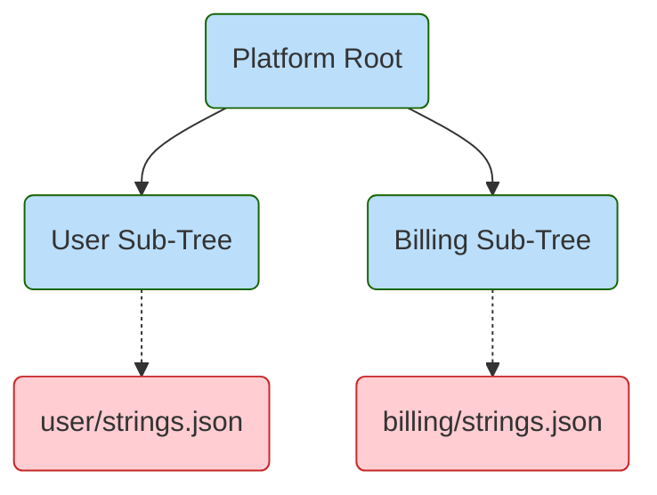

---

### Recommendation: Use a "Translation Port"

To keep the core **Green Layer** stable, define a **Port** (Interface) for localization in the Application layer, and implement the **Adapter** (the actual file lookup) in the Infrastructure/IO layer.

**Port:** `ILocalizer.Get(string key)` (Defined in Blue Layer).

**Adapter:** `JsonLocalizer` (Defined in Red Layer) that reads from the specific package's JSON file.


This ensures that our business logic remains **Cloud-Agnostic** and **Infrastructure-Agnostic**, only interacting with strings through lightweight, mockable edges.

---

## **4. Visual Language (The Color Scheme)**

Tree Architecture uses a standardized color palette in Mermaid diagrams to instantly identify the role and risk level of a Node.

### **Green Layer (Business Logic)**
*   **Color:** `#C8E6C9` (Light Green)
*   **Role:** The **Immutable Core**. Entities, Value Objects, Pure Functions, Policies.
*   **Characteristics:** High Stability ($W_N \approx 0$). Zero Dependencies on IO. 100% Test Coverage.

### **Blue Layer (Application)**
*   **Color:** `#BBDEFB` (Light Blue)
*   **Role:** **Components & Services**. Use Cases, Facades, Orchestration.
*   **Characteristics:** Wires the Green nodes together. Defines the "Ports" (Interfaces).

### **Yellow Layer (Interface Adapters)**
*   **Color:** `#FFF9C4` (Light Yellow)
*   **Role:** **Controllers, Presenters, Gateways**.
*   **Characteristics:** "Humble Objects". Converts data from External format to Internal format.

### **Red Layer (Infrastructure & IO)**
*   **Color:** `#FFCDD2` (Light Red)
*   **Role:** **Leaves**. Database Adapters, API Client implementations, File System access.
*   **Characteristics:** High Volatility. Contains specific "Dirty" dependencies (AWS SDK, SQL Drivers).

### **Purple Layer (Quality & Testing)**
*   **Color:** `#E1BEE7` (Purple)
*   **Role:** **Tests**. Unit, Integration, E2E.
*   **Characteristics:** The Verification Tree.

### **Orange Layer (Operations)**
*   **Color:** `#FFCC80` (Orange)
*   **Role:** **Gateways & Sanitizers**.
*   **Characteristics:** Special nodes that enforce regulatory boundaries or modify data flow for safety.

# **Anti-Patterns of Tree Architecture**

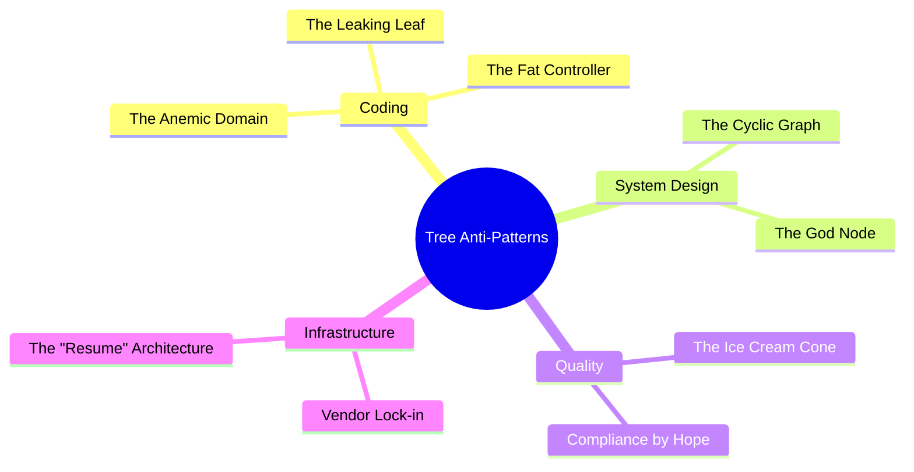

## **1. Coding Anti-Patterns**

Coding anti-patterns occur when the internal implementation of a node violates the principles of DDD or Clean Architecture, resulting in "Heavy Nodes" or "Heavy Edges."

### **1.1 The Anemic Domain**
This is the most common failure mode. The Domain Layer (Green) contains classes that look like Entities but are just bags of getters and setters. All the actual logic resides in "Service" classes.

*   **Symptoms:** `User` class has 0 methods besides accessors. `UserService` has 5000 lines of procedural code.
*   **Consequence:** High coupling. Complexity is not encapsulated. The Tree becomes a "Bush"—flat and tangled.
*   **Fix:** **Rich Domain Model.** Move logic from Services into Entities. `User.ChangePassword()` instead of `UserService.ChangePassword(User)`.

### **1.2 The Leaking Leaf**
Infrastructure details should never escape the IO Layer (Red). When they do, they "pollute" the upstream nodes.

*   **Symptoms:**
    *   `SQLException` caught in a Controller.
    *   `HttpServletRequest` passed to a Domain Service.
    *   `AWS S3 Object` returned by a Repository.
*   **Consequence:** The "Weight of Edge" ($W_E$) explodes. Changing the database now requires changing the Controller.
*   **Fix:** **Exception Translation** and **Data Mapping**. Catch `SQLException` in the Adapter and throw `DomainException`. Map `DbRow` to `DomainEntity`.

### **1.3 The Fat Controller**
Controllers (Yellow) should be "Humble Objects" (Complexity $\approx$ 1). When they contain business logic, they violate Separation of Concerns.

*   **Symptoms:** A Controller method that is > 20 lines long. Controller containing `if/else` logic about business rules.
*   **Consequence:** Business logic becomes untestable (requires HTTP context) and reusable (locked in a web handler).
*   **Fix:** **Delegate to Use Cases.** The Controller should only parse input and call `UseCase.Execute()`.

---

## **2. System Design Anti-Patterns**

### **2.1 The Cyclic Graph**
A Tree must be a Directed Acyclic Graph (DAG). Cycles are forbidden.

*   **Symptoms:** Package A depends on Package B, and Package B depends on Package A.
*   **Consequence:** "Infinite Edge Weight." You cannot compile, test, or deploy A without B. The system becomes a Monolith.
*   **Fix:** **Dependency Inversion.** Introduce an Interface in a third package (or within A) that B implements. Break the cycle.

### **2.2 The God Node**
A single Node (Component/Class) that knows too much or orchestrates too many things.

*   **Symptoms:** `SystemManager`, `MainProcessor`, `CommonUtils`. A node with $Fan_{in} > 20$ and $Fan_{out} > 20$.
*   **Consequence:** High instability ($I \approx 0.5$). Every change touches this node. High contention for developers.
*   **Fix:** **Decompose.** Break the God Node into smaller, cohesive responsibilities (Single Responsibility Principle).

---

## **3. Quality & Automation Anti-Patterns**

### **3.1 The Ice Cream Cone**
Relying on slow, flaky E2E tests instead of fast Unit tests.

*   **Symptoms:** 500 UI tests (Selenium) and 50 Domain Unit tests. CI takes 4 hours.
*   **Consequence:** Slow feedback loop. "Fear of Refactoring" because the tests are brittle.
*   **Fix:** **Invert the Pyramid.** Delete flaky E2E tests. Write Unit tests for the Domain Logic they were covering.

### **3.2 Compliance by Hope**
Relying on manual processes or developer discipline to ensure compliance (GDPR, HIPAA).

*   **Symptoms:** "Don't forget to encrypt PII" in the onboarding wiki. Manual code reviews catching data leaks.
*   **Consequence:** Human error is inevitable. Regulatory fines.
*   **Fix:** **Architectural Enforcement.** Make it impossible to write non-compliant code (e.g., Use types that strictly enforce encryption).

---

## **4. Infrastructure Anti-Patterns**

### **4.1 Vendor Lock-in (The "Hardcoded Cloud")**
Importing cloud-specific SDKs directly into Business Logic.

*   **Symptoms:** `import com.amazonaws.services.s3` in `InvoiceService`.
*   **Consequence:** You cannot run the system locally without an internet connection to AWS. You cannot switch to Azure. Testing requires complex mocks of 3rd party libs.
*   **Fix:** **Ports and Adapters.** Define `IFileStorage` in Domain. Implement `S3Storage` in Infrastructure.

### **4.2 The "Resume" Architecture (RDD)**
Resume Driven Development. Over-complicating the leaves with unnecessary technology.

*   **Symptoms:** Using Kubernetes for a static website. Using Kafka for a simple job queue.
*   **Consequence:** Operational complexity ($W_{ops}$) exceeds Business Value.
*   **Fix:** **Boring Technology.** Use the simplest implementation that satisfies the "Leaf" requirements.

---

# **Patterns of Tree Architecture**

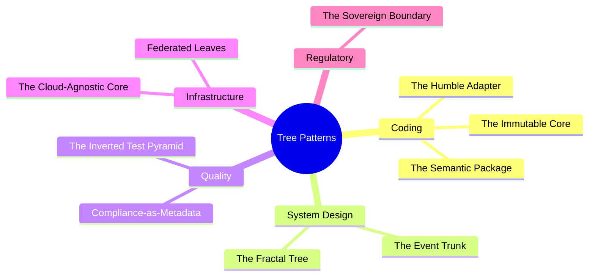

## **The Big Picture**

The following graph visualizes how these patterns interconnect to form a cohesive "Tree Architecture". It demonstrates a **Fractal System** (System Design) containing **Semantic Packages** (Coding), interacting with **Sovereign Infrastructure** (Regulatory) via **Cloud-Agnostic Ports** (Infrastructure).

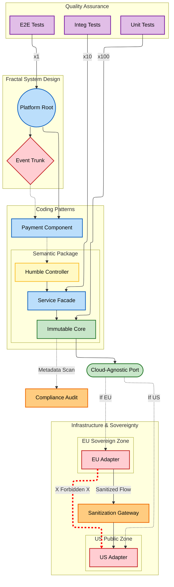

## **1. Coding Patterns**

Coding patterns in Tree Architecture focus on the internal structure of nodes and the nature of the edges connecting them. They are designed to minimize the "Weight of Nodes" ($W_N$) and the "Weight of Edges" ($W_E$).

### **1.1 The Semantic Package (Vertical Slicing)**
Instead of organizing code by technical layer (e.g., `controllers/`, `services/`, `models/`), Tree Architecture favors organization by Component or Semantic Identity. This aligns with the "Sub-Tree" concept, where a feature is a self-contained branch.

**Implementation:**
*   **Package by Component:** A folder named `payment` contains its own `PaymentController`, `PaymentService`, `PaymentPolicy`, and `PaymentRepository`.
*   **Encapsulation:** Only the `PaymentFacade` or `PaymentService` interface is public. Internal domain logic is package-private, preventing other parts of the tree from depending on internal details.

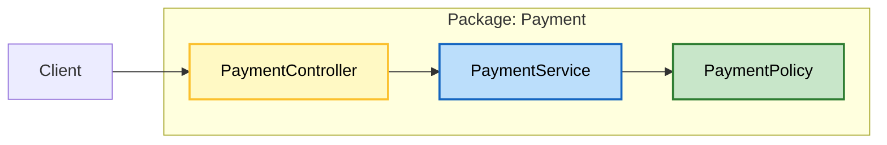


### **1.2 The Immutable Core**
The Root and Inner Branches (Domain Layer) must be the most stable parts of the system. To ensure this, we favor immutability.

**Implementation:**
*   **Immutable Value Objects:** `Money`, `Address`, `Email` are final/sealed classes with no setters. They replace primitive types (`string`, `int`) to encapsulate validation logic.
*   **Pure Functions:** Domain logic is implemented as pure functions where possible, side-effect free. This reduces the Cyclomatic Complexity ($W_N$) by eliminating hidden state mutations.

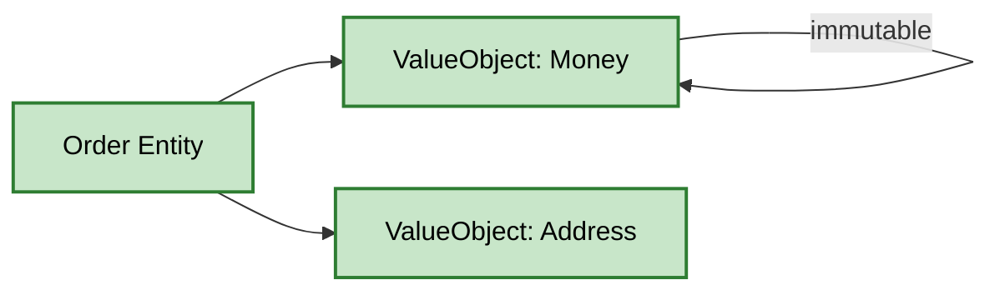


### **1.3 The Humble Adapter**
Controllers and Presenters (Interface Adapters) often accumulate logic, becoming "Fat Controllers." The Humble Adapter pattern forces these nodes to be "Humble Objects"—they contain *no* business logic, only data conversion.

**Implementation:**
*   **Role:** Convert HTTP Request $\rightarrow$ Domain Command. Call Domain. Convert Domain Result $\rightarrow$ HTTP Response.
*   **Metric:** If a Controller has a Cyclomatic Complexity > 2, it is a smell.
*   **Weight:** Keeps $\lambda_{controller} \approx 0.8$.

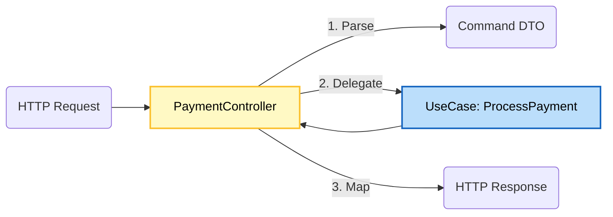


---

## **2. System Design Patterns**

### **2.1 The Fractal Tree**
Large systems should not be monolithic trees but rather a forest of interacting trees, or a large tree composed of smaller, self-similar sub-trees.

**Implementation:**
*   **Composition:** A "User" system and a "Billing" system are separate trees. They can be composed into a "Platform" super-tree where the "Platform" root coordinates them.
*   **Scalability:** Each sub-tree can be deployed as a separate microservice if the "Edge Weight" between them becomes too high for a monolithic deployment.

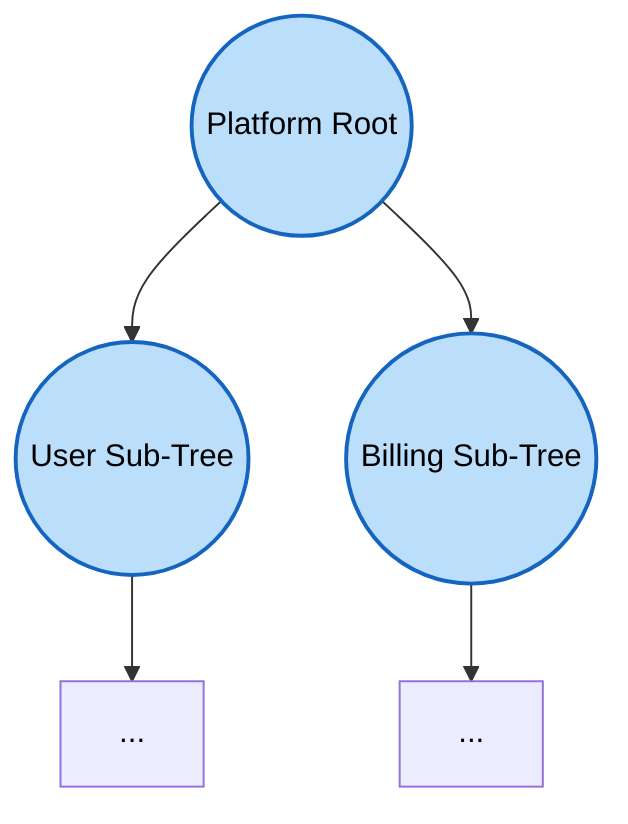


### **2.2 The Event Trunk**
To decouple sub-trees (e.g., `Order` tree triggering `Shipping` tree), we use Domain Events.

**Implementation:**
*   **Mechanism:** `Order` emits an `OrderPlaced` event. This event travels down the trunk (or a specialized Event Bus). `Shipping` subscribes to it.
*   **Benefit:** Removes direct dependencies ($W_E$). The `Order` domain does not know `Shipping` exists.
*   **Topology:** The Event Bus acts as a "Virtual Root" for cross-domain coordination.

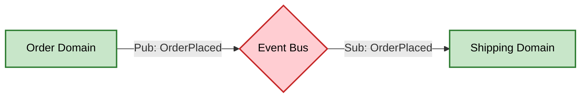


---

## **3. Quality & Automation Patterns**

### **3.1 The Inverted Test Pyramid**
Because the Domain layer is pure and isolated (no IO), it is extremely cheap to test.

**Implementation:**
*   **Structure:**
    *   **Unit Tests (80%):** Test valid/invalid states of Entities and Value Objects. mock nothing (they are pure).
    *   **Integration Tests (15%):** Test that Adapters correctly implement Ports (e.g., "Does PostgresAdapter actually save to SQL?").
    *   **E2E Tests (5%):** Smoke tests to ensure the tree is wired correctly.
*   **Metric:** A "Heavy" test suite (long runtime) usually indicates a violation of the pure core principle.

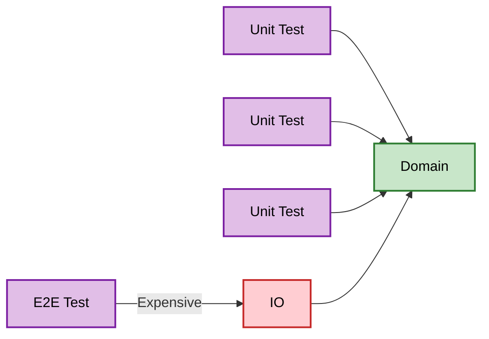


### **3.2 Compliance-as-Metadata**
Regulatory compliance is often a cross-cutting concern. In Tree Architecture, we treat compliance as metadata attached to nodes.

**Implementation:**
*   **Tagging:** Nodes (especially Data Objects) are tagged with Decorators/Attributes: `@PII`, `@PHI`, `@Sovereign("EU")`.
*   **Automated Auditing:** A static analysis tool traverses the tree. If a `@PII` node has an edge to a `LogAdapter` node that is not compliant, the build fails.

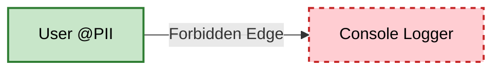


---

## **4. Infrastructure Patterns**

### **4.1 The Cloud-Agnostic Core**
The Domain layer (Green/Blue layers) must have zero references to cloud-specific SDKs.

**Implementation:**
*   **Rule:** No `import aws_sdk` or `using Azure.Storage` in the Core.
*   **Mechanism:** Define `IBlobStorage` in the Core. Implement `S3BlobStorage` in the Infrastructure Layer (Red).
*   **Benefit:** "Vendor Lock-in" becomes a configuration detail of the leaves, not a structural constraint of the trunk.

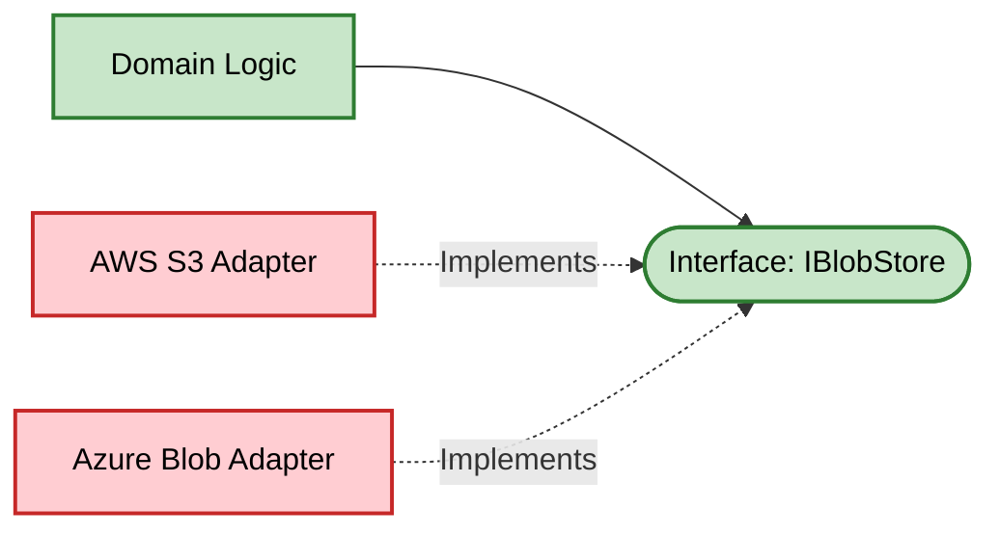


### **4.2 Federated Leaves**
For systems spanning multiple jurisdictions, "Leaves" can be swapped based on runtime context.

**Implementation:**
*   **Dynamic Binding:** The Application Root can inject `EuStorageAdapter` for EU users and `UsStorageAdapter` for US users.
*   **Topology:** The Tree stays the same; the leaves change. This allows a single codebase to serve multiple regulatory environments.

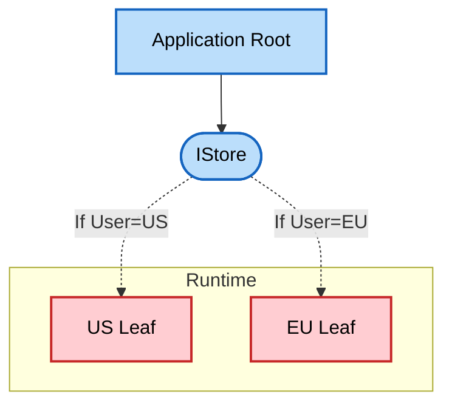


---

## **5. Regulatory, Compliance, and Sovereignty Patterns**

### **5.1 The Sovereign Boundary**
Data Sovereignty laws (e.g., GDPR, PIPEDA, CCPA) strictly define where data can physically reside ("Data Residency"). In Tree Architecture, we model these legal boundaries as strict graph boundaries.

**Implementation:**
*   **Runtime Sovereignty Context:** The "Root" of the application is aware of the current user's jurisdiction.
*   **Data Residency via Polymorphism:** The Application Core defines a generic `IStoragePort`. The Infrastructure Layer implements this port with legally distinct adapters: `EuStorageAdapter` (Frankfurt Region) and `UsStorageAdapter` (Virginia Region).
*   **Verification:** Graph Theory proves that an Application Instance initialized with `Context=EU` cannot instantiate or reach a `UsStorageAdapter` node.

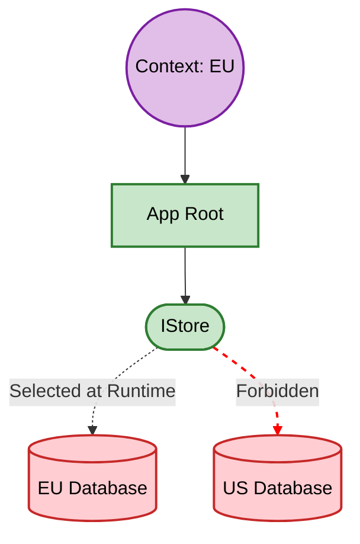

### **5.2 The Sanitization Gateway**
Sometimes, data *must* cross a boundary (e.g., aggregating global metrics). To do this legally, it must pass through a "Choke Point" that removes sensitive info.

**Implementation:**
*   **The Gateway Pattern:** A specialized Service or Anti-Corruption Layer (ACL) that sits between two Sovereign Zones.
*   **Mechanism:** `EU_Zone -> Gateway.Anonymize() -> US_Zone`.
*   **Rule:** The graph is invalid if there is an edge from EU to US that does *not* target a Gateway Node.

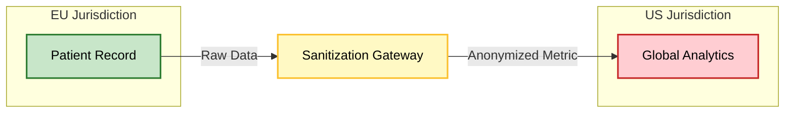

### **5.3 Compliance-as-Code Verification**
Instead of relying on written policies ("Do not log PII"), we use the Tree to generate audit reports.

**Implementation:**
*   **Metadata Tagging:** We tag Data Objects with classification levels: `@Public`, `@Internal`, `@Confidential`, `@Restricted`.
*   **Component Classification:** We tag Sinks (Outputs) with their clearance level: `ConsoleLogger (@Public)`, `SecureVault (@Restricted)`.
*   **Automated Audit:** The build pipeline walks the graph. If a `@Restricted` node has a path to a `@Public` sink, the build fails.

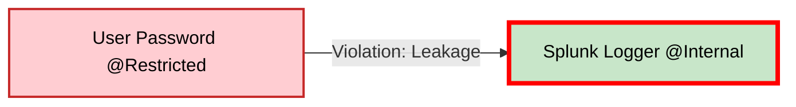

# **Tree Architecture Migration Guide: Pruning and Grafting**

## **1. Architectural Horticulture**

Migrating a legacy system to Tree Architecture is not a "Rewrite"; it is a process of **Pruning** (removing dead or dangerous dependencies) and **Grafting** (introducing healthy, isolated sub-trees).

We assume the starting state is a "Tangled Bush"—a system with high entropy, cyclic dependencies, and no clear root.

---

## **2. The Baseline: "The Tangled Bush"**

**State:** High Entropy. "God Objects". "Fat Controllers". "Leaking Leaves".
**Symptoms:** `UserService` does everything. `UserController` talks to `DB`. `UserEntity` is empty.

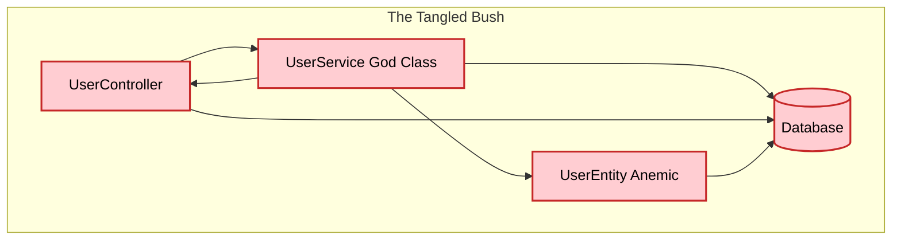

---

## **3. Phase 1: Soil Preparation (The Semantic Package)**

**Strategy:** Vertical Slicing.
We do not change the code logic yet. We simply move files into folders based on their **Semantic Identity** (Component).
**Goal:** Identify the "User" sub-tree, even if it is still messy.

```mermaid
graph TB
  classDef component fill:#BBDEFB,stroke:#1565C0,color:#000,stroke-width:2px;
  classDef bad fill:#FFCDD2,stroke:#C62828,color:#000,stroke-width:2px;

  subgraph Package_User [User Component]
    C[UserController]:::bad
    S[UserService]:::bad
    E[UserEntity]:::bad
    DB[(Database)]:::bad

    C --> S
    S --> DB
  end
```

---

## **4. Phase 2: Pruning the Leaves (Fixing Infrastructure)**

**Strategy:** Dependency Inversion.
We attack the "Leaking Leaf" and "Fat Controller".
1.  **Extract Interface:** Create `IUserRepository` (Port) in the Component.
2.  **Invert DB:** Make `DatabaseAdapter` implement `IUserRepository`.
3.  **Humble Controller:** Remove business logic from Controller; delegate to Service.

**Result:** The IO Layer (Red) is pushed to the edges.

```mermaid
graph TB
  classDef component fill:#BBDEFB,stroke:#1565C0,color:#000,stroke-width:2px;
  classDef controller fill:#FFF9C4,stroke:#FBC02D,color:#000,stroke-width:2px;
  classDef io fill:#FFCDD2,stroke:#C62828,color:#000,stroke-width:2px;
  classDef bad fill:#FFCDD2,stroke:#C62828,color:#000,stroke-width:2px;

  subgraph Package_User [User Component]
    direction TB
    C[Humble Controller]:::controller --> S[UserService]:::bad
    S --> Port([IUserRepository]):::component
  end

  DB[SQL Adapter]:::io -.->|Implements| Port
  Client --> C
```

---

## **5. Phase 3: Grafting the Core (Fixing Domain)**

**Strategy:** The Immutable Core.
We attack the "Anemic Domain" and "God Service".
1.  **Move Logic:** Move validation and business rules from `UserService` to `UserEntity`.
2.  **Value Objects:** Introduce `Email` and `Money` Value Objects to replace primitives.
3.  **Shrink Service:** The Service becomes a Facade that just coordinates the Entity and the Repo.

**Result:** The Green Core emerges.

```mermaid
graph TB
  classDef component fill:#BBDEFB,stroke:#1565C0,color:#000,stroke-width:2px;
  classDef business fill:#C8E6C9,stroke:#2E7D32,color:#000,stroke-width:2px;
  classDef controller fill:#FFF9C4,stroke:#FBC02D,color:#000,stroke-width:2px;
  classDef io fill:#FFCDD2,stroke:#C62828,color:#000,stroke-width:2px;

  subgraph Package_User [User Component]
    direction TB
    C[Humble Controller]:::controller --> S[Service Facade]:::component
    S --> Dom[User Entity]:::business
    Dom --> Vo[Email VO]:::business
    S --> Port([IUserRepository]):::component
  end

  DB[SQL Adapter]:::io -.-> Port
```

---

## **6. Phase 4: Training the Branches (Final Structure)**

**Strategy:** Pruning Dependencies ($W_E$).
We ensure the Tree is healthy and compliant.
1.  **Remove Lateral Edges:** Ensure `User` component does not directly call `Billing`. Use Events.
2.  **Compliance Check:** Tag the `UserEntity` with `@PII` and verify no leaked edges.

**Result:** A Fractal Tree.

```mermaid
graph TB
  classDef business fill:#C8E6C9,stroke:#2E7D32,color:#000,stroke-width:2px;
  classDef component fill:#BBDEFB,stroke:#1565C0,color:#000,stroke-width:2px;
  classDef controller fill:#FFF9C4,stroke:#FBC02D,color:#000,stroke-width:2px;
  classDef io fill:#FFCDD2,stroke:#C62828,color:#000,stroke-width:2px;

  subgraph System
    EventBus{Event Trunk}:::io

    subgraph Package_User [User Tree]
        direction TB
        UC[User Controller]:::controller --> US[User Service]:::component
        US --> U_Dom[User Root]:::business
    end

    subgraph Package_Billing [Billing Tree]
        direction TB
        BC[Billing Controller]:::controller --> BS[Billing Service]:::component
        BS --> B_Dom[Billing Root]:::business
    end

    US --> EventBus
    EventBus --> BS
  end
```

---

## **7. Phase 5: Pruning the Test Suite**

**Strategy:** Inverting the Pyramid.
Legacy systems often rely on the "Ice Cream Cone" anti-pattern: slow, flaky E2E tests because the domain logic is coupled to the database. We migrate by deleting E2E tests as we cover the new Grafted Core with Unit Tests.

1.  **Stop writing E2E:** Freeze the Ice Cream Cone.
2.  **Backfill Unit Tests:** For every piece of logic moved to `UserEntity` (Green), write a fast Unit Test.
3.  **Delete E2E:** Once the Unit Tests pass, delete the corresponding E2E scenario.

**Evolution:**

### **Before: The Ice Cream Cone**
Heavy reliance on slow E2E tests hitting the IO layer.

```mermaid
graph TB
  classDef bad fill:#FFCDD2,stroke:#C62828,color:#000,stroke-width:2px;
  classDef io fill:#FFCDD2,stroke:#C62828,color:#000,stroke-width:2px;
  classDef test fill:#E1BEE7,stroke:#7B1FA2,color:#000,stroke-width:2px;

  subgraph TestSuite
    E2E[500 E2E Scenario Tests]:::bad
    Unit[50 Unit Tests]:::test
  end

  subgraph System
    UI[Web Controller]:::io
    DB[(Database)]:::io
  end

  E2E -- "Slow & Flaky (1hr)" --> UI
  UI -.-> DB
  Unit -.-> UI
```

### **After: The Inverted Pyramid**
Fast Unit Tests cover the Domain. Minimal E2E for smoke testing.

```mermaid
graph TB
  classDef start fill:#C8E6C9,stroke:#2E7D32,color:#000,stroke-width:2px;
  classDef component fill:#BBDEFB,stroke:#1565C0,color:#000,stroke-width:2px;
  classDef io fill:#FFCDD2,stroke:#C62828,color:#000,stroke-width:2px;
  classDef test fill:#E1BEE7,stroke:#7B1FA2,color:#000,stroke-width:2px;

  subgraph TestSuite
    Unit[5000 Domain Unit Tests]:::test
    Integ[50 Integration Tests]:::test
    E2E[10 Smoke Tests]:::test
  end

  subgraph TreeArchitecture
    Dom[Immutable Core]:::start
    Port([Interface Adapter]):::component
    Root[App Root]:::io
  end

  Unit -- "Instant (2s)" --> Dom
  Integ -- "Fast (30s)" --> Port
  E2E -- "Slow (2m)" --> Root
```

## **The Leaf Saturation Principle (LSP)**

The **Leaf Saturation Principle** states that as the cumulative weight of external dependencies (Infrastructure Leaves) exceeds the structural integrity of the Domain Root, the tree must undergo **fission** to maintain maintainability and minimize Propagation Cost ($P_C$).

### **1. Mathematical Detection: The Splitting Threshold**

To determine when a tree should be split, we utilize the **Tree Heavy-Index ($I_H$)**. This index compares the weight of the "Leaves" (external packages) to the complexity of the "Root" (business logic).

### **The Variables**

* **$W_L$ (Leaf Weight):** The sum of weights of all external packages. For a single package $i$, $W_i = (\text{Binary Size} \times \text{API Surface Area})$.  
* **$W_R$ (Root Complexity):** The number of Domain Entities and Use Cases in the Blue/Green layers.  
* **$D_T$ (Tree Depth):** The number of layers from Root to furthest Leaf.

### **The Threshold Formula**

A tree is considered "Saturated" and ready for splitting when:  

$$
I_H = \frac{(\sum_ {W_L} \times \log_{2}(D_T + 1))}{W_R}> \tau
$$

Where $\tau$ (the Threshold Constant) is typically set based on team velocity or build times.  
**Recommended Split Indicator:**

* **$I_H > 0.8$:** Warning state (Structural Stress).  
* **$I_H > 1.2$:** Critical state (Mandatory Fission).

### **Qualitative Indicators**

* **Deployment Friction:** The tree requires a full container rebuild for a minor domain change due to heavy library linking.  
* **Namespace Pollution:** Autocomplete or dependency injection containers are cluttered with external types irrelevant to the core domain.

## **2. The Splitting Protocol: Fractal Fission**

Once a threshold is breached, the monolithic tree is split into a **Fractal Forest**. This is carried out in four steps:

### **Step 1: Identify the "Branch Point"**

Locate the specific branch in the **Yellow (Application)** layer that is pulling in the majority of the heavy dependencies. Usually, this corresponds to a specific sub-domain (e.g., "Reporting" pulling in heavy PDF/Chart libraries).

### **Step 2: Establish the Event Trunk**

Before physically moving code, implement an **Event Trunk** between the main tree and the intended sub-tree.

* The main tree will emit DomainEvents.  
* The sub-tree will subscribe to these events.  
* *This replaces direct method calls (Edges) with asynchronous messages.*

### **Step 3: Root Extraction**

Promote the identified branch to its own **Root**.

1. Create a new Mermaid tree diagram.  
2. The "Branch" becomes the new **Blue (Domain) Root**.  
3. Migrate the heavy **Red (Infrastructure) Leaves** to this new tree.

### **Step 4: The Platform Super-Root**

To maintain system cohesion, create a "Platform" diagram where the original Root and the new Root are shown as sibling nodes, connected only by the Shared Infrastructure (the "Ground").

## **3. Visual Representation of Fission**

**Before Fission (Saturated):**  
```mermaid
graph TD
    Root[Domain Root] --> UseCase[Heavy Reporting UseCase]
    UseCase --> LibA[PDF Library - 50MB]
    UseCase --> LibB[Charting Library - 30MB]
    style LibA fill:#f96,stroke:#333
    style LibB fill:#f96,stroke:#333
```

**After Fission (Fractal Forest):**  
```mermaid
graph TD
    subgraph Core_Tree
    Root1[Core Domain]
    end
      
    subgraph Reporting_Tree
    Root2[Reporting Domain] --> LibA[PDF Lib]
    Root2 --> LibB[Chart Lib]
    end

    Root1 -.->|Event Trunk| Root2
```

## **Summary of Benefits**

1. **Isolated Bloat:** Updates to the heavy PDF library only require re-testing and re-deploying the Reporting Tree.  
2. **Cognitive Load Reduction:** Developers working on the Core Tree don't need to see or understand the complex "Leaf" dependencies of the Reporting Tree.  
3. **Parallel Evolution:** The two trees can now use different versions of the same library if necessary, resolving "Dependency Hell."


#### **Works cited**

1. Hexagonal Architecture and Clean Architecture (with examples) - DEV Community, https://dev.to/dyarleniber/hexagonal-architecture-and-clean-architecture-with-examples-48oi
2. AWS Prescriptive Guidance - Building hexagonal architectures on AWS - AWS Documentation, https://docs.aws.amazon.com/pdfs/prescriptive-guidance/latest/hexagonal-architectures/hexagonal-architectures.pdf
3. Graph-Based Reasoning and Verification - Emergent Mind, https://www.emergentmind.com/topics/graph-based-reasoning-and-verification
4. Weighted Graphs — When Connections Have Cost | by Fabricio Engeroff - Medium, https://medium.com/@fa.engeroff1996/weighted-graphs-when-connections-have-cost-83eb30e10f61
5. Tree cheatsheet for coding interviews - Tech Interview Handbook, https://www.techinterviewhandbook.org/algorithms/tree/
6. Domain-Driven Design Explained: A Real World Example - DEV Community, https://dev.to/leapcell/domain-driven-design-explained-a-real-world-example-581j
7. DDD Modelling - Aggregates vs Entities: A Practical Guide - Dan Does Code, https://www.dandoescode.com/blog/ddd-modelling-aggregates-vs-entities
8. Entity , Value Object , Aggregate and Aggregate Root in DDD | by Arun Badhai - Medium, https://medium.com/@arun.badhai/entity-value-object-aggregate-and-aggregate-root-in-ddd-9fb9342c1df0
9. Hexagonal architecture pattern - AWS Prescriptive Guidance, https://docs.aws.amazon.com/prescriptive-guidance/latest/cloud-design-patterns/hexagonal-architecture.html
10. Sairyss/domain-driven-hexagon: Learn Domain-Driven Design, software architecture, design patterns, best practices. Code examples included - GitHub, https://github.com/Sairyss/domain-driven-hexagon
11. What is Software Complexity? Know the Challenges and Solutions - vFunction, https://vfunction.com/blog/software-complexity/
12. Cyclomatic complexity - Wikipedia, https://en.wikipedia.org/wiki/Cyclomatic_complexity
13. The IntelliEstimator: Estimating Maintenance Cost and Prediction of Software Quality, Reliability, and Maintenance Using Stackin - International Research Journal of Multidisciplinary Scope (IRJMS), https://www.irjms.com/wp-content/uploads/2025/04/Manuscript_IRJMS_03365_WS.pdf
14. Metric Descriptions, https://gromit.iiar.pwr.wroc.pl/p_inf/ckjm/metric.html
15. Budgeting for Software Maintenance - Baytech Consulting, https://www.baytechconsulting.com/blog/projecting-costs-in-software-maintenance
16. Clean Architecture: A Craftsman's Guide to Software Structure and Design (Robert C. Martin Series) - GitHub, https://raw.githubusercontent.com/sdcuike/Clean-Code-Collection-Books/master/Clean%20Architecture%20A%20Craftsman's%20Guide%20to%20Software%20Structure%20and%20Design.pdf
17. (PDF) Systematically reviewing the layered architectural pattern principles and their use to reconstruct software architectures - ResearchGate, https://www.researchgate.net/publication/356790215_Systematically_reviewing_the_layered_architectural_pattern_principles_and_their_use_to_reconstruct_software_architectures
18. Clean Architecture – How to Quantify Component Coupling - Coding Blocks, https://www.codingblocks.net/podcast/clean-architecture-how-to-quantify-component-coupling/
19. My Book Notes: Clean Architecture by Robert C. Martin | by ismail bayram | Medium, https://medium.com/@ismailbayram.ce/my-book-notes-clean-architecture-by-robert-c-martin-d0d832eb8b66
20. Stable Dependencies Principle: I struggle to understand something. : r/AskProgramming - Reddit, https://www.reddit.com/r/AskProgramming/comments/16in7o3/stable_dependencies_principle_i_struggle_to/
21. Technical Debt and System Architecture: The Impact of Coupling on Defect-related Activity, https://www.hbs.edu/faculty/Pages/item.aspx?num=51343
22. Exploring the Structure of Complex Software Designs: An Empirical Study of Open Source and Proprietary Code | Request PDF - ResearchGate, https://www.researchgate.net/publication/220534289_Exploring_the_Structure_of_Complex_Software_Designs_An_Empirical_Study_of_Open_Source_and_Proprietary_Code
23. Research on Control Strategy of Design Change Cross-Module Propagation - MDPI, https://www.mdpi.com/2073-8994/14/2/368
24. A metric for quantifying the ripple effects among requirements, https://t2do.uom.gr/papers/J1.pdf
25. Code metrics - Maintainability index range and meaning - Visual Studio (Windows), https://learn.microsoft.com/en-us/visualstudio/code-quality/code-metrics-maintainability-index-range-and-meaning?view=visualstudio
26. Exploring Maintainability Index Variants for Software Maintainability Measurement in Object-Oriented Systems - MDPI, https://www.mdpi.com/2076-3417/13/5/2972
27. Efficient Integration Testing using Dependency Analysis - Microsoft, https://www.microsoft.com/en-us/research/wp-content/uploads/2016/02/tr-2005-94.pdf
28. Mindmaps - Mermaid Chart, https://docs.mermaidchart.com/mermaid-oss/syntax/mindmap.html
29. Theme Configuration - Mermaid, https://mermaid.js.org/config/theming.html
30. How to specify a custom color them for mermaid mind maps · quarto-dev · Discussion #12304 - GitHub, https://github.com/quarto-dev/quarto-cli/discussions/12304
31. Change Propagation for Assessing Design Quality of Software Architectures, https://www.computer.org/csdl/proceedings-article/wicsa/2005/25480205/12OmNzV70xz
32. Measuring Impact of Dependency Injection on Software Maintainability - MDPI, https://www.mdpi.com/2073-431X/11/9/141
33. Clean Architecture - Patterns, Practices, and Pri... | MindMeister Mind map, https://www.mindmeister.com/704027387/clean-architecture-patterns-practices-and-principles
34. The Dependency Rule | Khalil Stemmler, https://khalilstemmler.com/wiki/dependency-rule/
35. Clean Architecture: The essence of the dependency rule | by Nicholas Ocket | Medium, https://medium.com/@aboutcoding/clean-architecture-the-essence-of-the-dependency-rule-969f1e8417f6
36. Mermaid FlowChart Basic Syntax, https://docs.mermaidchart.com/mermaid-oss/syntax/flowchart.html
37. Mindmap - Mermaid, https://mermaid.js.org/syntax/mindmap.html
38. A Critical Review for Software Maintenance Cost Estimation Models: A Data Driven Approach, https://ieeexplore.ieee.org/iel8/6287639/10820123/11202308.pdf
39. (PDF) Software Maintenance Cost Estimation - ResearchGate, https://www.researchgate.net/publication/314537392_Software_Maintenance_Cost_Estimation
40. Formal Verification of Software Architecture - Clemson OPEN, https://open.clemson.edu/cgi/viewcontent.cgi?article=1117&context=grads_symposium
